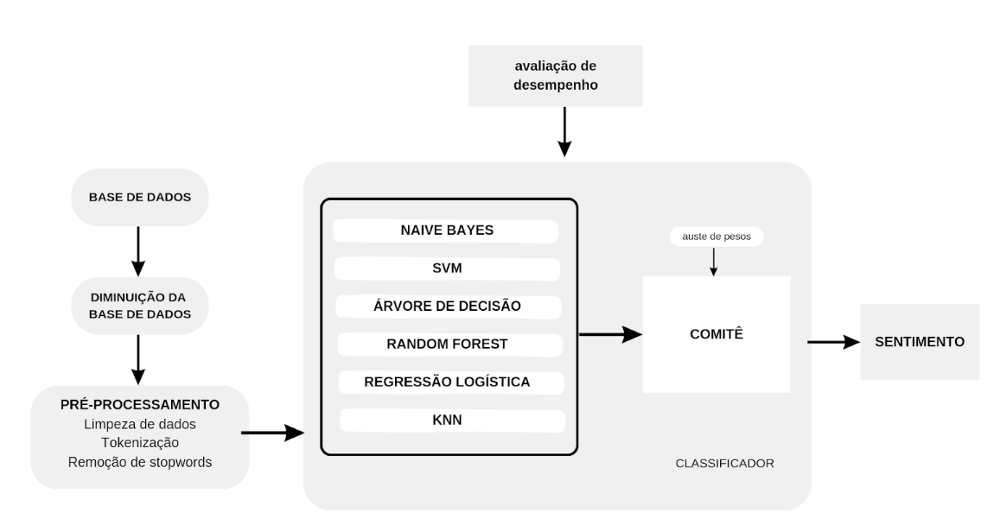

# Qual o melhor modelo de classificação para análise de sentimentos?

O projeto abaixo foi realizado como artigo final da aula de mestrado de Inteligência Artificial na UFABC, lecionada por Prof. Dr. Paulo Henrique Pisani. Confira o [artigo completo aqui.](https://docs.google.com/document/d/1JmqoTjxQB0nLQ01GCQ2r9gjjxaYkh3ZDuuCUgn9iVX0/edit?usp=sharing)

Este trabalho revisita e amplia o estudo feito por Aguiar et al. (2018) sobre a análise de sentimentos em tweets em português. O objetivo é encontrar o melhor algoritmo para identificar se um tweet é positivo ou negativo.

Para isso, usamos um conjunto de dados que foi rotulado manualmente e que contém 785.814 tweets no total, que está disponível no [kaggle](https://www.kaggle.com/datasets/augustop/portuguese-tweets-for-sentiment-analysis?resource=download). Desses, 263.107 são classificados como positivos e 522.707 como negativos. No entanto, devido a limitações de hardware, estamos utilizando apenas cerca de 4.000 tweets para treinar os algoritmos: 2.000 tweets positivos e 2.000 negativos.

Neste trabalho, comparamos diferentes algoritmos de aprendizado de máquina para analisar sentimentos em tweets. Entre os algoritmos que testamos, o *Naive Bayes se destacou como o melhor*, mostrando os melhores resultados em termos de acurácia, precisão, recall, F1 Score e erro.

Apesar da expectativa de que o algoritmo de comitê (que combina vários modelos) teria um desempenho superior, como sugerido por Kumar e Ayyappan (2017) e Aguiar et al. (2018), isso não aconteceu. O motivo principal foi o alto erro do KNN, que afetou negativamente o desempenho geral do comitê.

Embora os resultados sejam bons no contexto deste estudo, é importante observar que a acurácia geral dos modelos ainda pode não ser suficiente para aplicações práticas em ambientes empresariais ou em outros projetos científicos, onde uma maior precisão é frequentemente necessária para obter resultados mais confiáveis.

[Confira o código e os resultados.](https://github.com/crhisangela/Analise-de-sentimento/blob/main/main.ipynb)

### Referências
AUGUSTO, P. Portuguese Tweets for Sentiment Analysis. Kaggle, 2024. Disponível em: https://www.kaggle.com/datasets/augustop/portuguese-tweets-for-sentiment-analysis?resource=download. Acesso em: 20 jul. 2024.